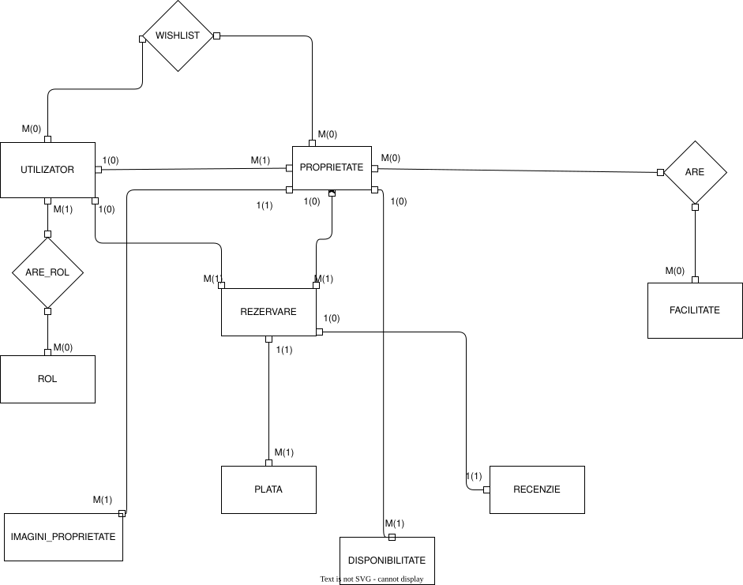

#  Proiect Baze de Date- Airbnb type

## 1.Descrierea modelului real, a utilitatii acestuia si a regulilor de functionare
 CityStay reprezinta o aplicaatie web de tip Airbnb, utilizata pentru rezervarea apartamentelor pe o perioada determinata, fiind disponibila la nivel global. Platforma faciliteaza interactiunea intre utilizatori care pot avea roluri diferite, respectiv gazda si oaspete, un utilizator avand posibilitatea de a indeplini simultan ambele roluri.

Pentru utilizarea aplicatiei, fiecare utilizator va trebui sa-si creeze un cont, completand informatii precum prenumele, numele, emailul, numarul de telefon, o parola, data nasterii si o poza de profil autentica. In plus, fiecarui utilizator i se atribuie automat un identificator unic la inregistrare pe platforma.

 Utilizatorii care au rol de gazda pot pubica anunturi pentru proprieteti disponibile pentru inchiriere. La fiecare publicatie a unui utilizator - gazda, este necesara completarea datelor despre spatiul dat spre inchiriere. Fiecare proprietate are atasata automat identificatorul gazdei, iar proprietarul trebuie sa publice numele proprietetii, descrierea apartamentului, tipul acestuia(apartament/casa/penthouse etc), numarul maxim de persoane acceptate, numarul de camere(dormitoare, bai, paturi etc) si pretul pe noapte, care poate varia in functie de disponibilitate sau de perioada. Este obligatorie completarea facilitatilor disponibile pentru apartament. Pentru postarea unui astfel de anunt sunt necesare un set de poze clare si autentice care sa reflecte in mod real proprietatea.

Utilizatorii care au rol de oaspete pot efectua rezervari pentru proprietati disponibile. Fiecare rezervare este identificata printr-un id unic si este asociata atat unui utilizator, cat si unei proprietati. In cadrul unei rezervari, utilizatorul trebuie sa specifice data sosirii, data plecarii si numarul de persoane, iar in urma acestor informatii se calculeaza automat pretul total al sederii.

In urma unei rezervari se efectueaza o plata care este identificata printr-un id unic, iar totalul/suma platii este calculata pe baza proprietatii pe care a ales-o utilizatorul oaspete. Utilizatorul are dreptul de a-si alege metoda platii. In urma tranzactiei, se completeaza si statusul platii.

Platforma permite, de asemenea, adaugarea de recenzii pentru proprietati, insa doar de catre utilizatori care au efectuat anterior o rezervare pentru acea proprietate, asigurand astfel autenticitatea feedback-ului oferit

Orice persoana inregistrata pe platforma CityStay are posibilitatea de a-si crea un Wishlist in care poate salva proprietati pentru rezervari viitoare.

In ceea ce priveste regulile de functionare ale sistemului, un utilizator poate avea unul sau maia multe roluri, o proprietate apartine unui singur utilizator, iar un utilizator poate efectua mai multe rezervari. Fiecare rezervare este asociaata unei singure proprieteti, iar renziile pot fi aduagate exclusiv in urma unei rezervari efectuate in trecut. In plus, un utilizator poate adauga mai multe proprietati in cadrul wishlist-ului personal.

## 2.Prezentarea constrangerilor(reguli, restrictii) impuse asupra modelului.

- Un utilizator poate avea unul sau doua roluri pe platforma(gazda/oaspete)
- O proprietate trebuie sa fie detinuta de un singur utilizator. 
- Este obligatoriu ca o proprietate sa fie insotita de un set de poze care sa reflecte realitatea
- O rezervare trebuie sa corespunda unei singure prroprrietatati si unui singur utilizator
- Recenziie pentru o proprietate pot fi postate doar in urma efectuarii unei rezervari efectuate in trecut.
- O proprietate nu poate fi data spre inchiriere daca nu este disponibila pe perioada solicitata de oaspete
- Wishlist-ul unui utilizator poate contine niciuna sau mai multe proprietati
- O plata este efectuata doar in urma unei rezervari

## 3.Descrierea entitatilor, incluzand precizarea cheii primare.
#### Utilizator:
- persoana care detine un cont pe platforma web CityStay
- poate avea unul sau doua roluri(gazda/oaspete)
- cheie primara: **utilizator_id**

#### Proprietate:
- spatiul de inchiriat pentru utilizatorii de tip oaspete
- cheie primara: **proprietate_id**

#### Rezervare:
- rezervarea unei proprietati de catre un utilizator
- cheie primara: **rezervare_id**

#### Facilitati:
- lista totala a facilitatilor
- cheie primara: **facilitate_id**

## 4.Descrierea relatiilor, incluzand precizarea cardinalitatii acestora

- **Utilizator-Proprietate**: one-to-many

    Un utilizator poate sa aiba niciuna sau mai multe proprietati
    
    O proprietate trebuie sa fie **obligatoriu** detinuta de un utilizator
---
- **Proprietate-Rezervare**: one-to-many

    O proprietate poate sa aiba niciuna sau mai multe rezervari in timp

    O rezervare trebuie sa fie asociata obligatoriu unei singure proprietati
---
- **Rezervare-Plata**: one-to-many

    O rezervare poate sa aiba una sau mai multe plati(in posibilitatea esuarii unei plati)

    O plata este asociata unei singure plati
---
- **Rezervare-Recenzie**: one-to-one

    O rezervare poate avea ce mult o recenzie

    O recenzie trebuie sa fie asociata obligatoriu unei plati

---
- **Utilizator-Rol**: many-to-many

    Un utilizator poate avea unul sau doua roluri pe platforma web CityStay(gazda/oaspete)

    Un rol poate fi atribuit niciunuia sau mai multor utilizatori
---
- **Proprietate-Facilitate**: many-to-many

    O proprietate poate sa aiba una sau mai multe faciliatati

    O facilitate poate sa apartina niciuneia sau mai multor proprietati
---
- **Proprietate-Imagine_proprietate**: one-to-many

    O proprietate trebuie sa aiba minim o imagine disponibila

    O imagine trebuie sa fie asociata obligatoriu unei singure proprietati

---

- **Utilizator-Rezervare**: one-to-many

    Un utilizator poate sa aiba niciuna sau mai multe rezervari

    O rezervare este efectuata de un singur utilizator 

---
- **Proprietate-Disponibilitate**: one-to-many

    O proprietate poate sa aiba niciuna sau mai multe inregistrari de disponibilitate

    O inregistrare de disponibilitate trebuie sa fie asociata obligatoriu unei singure proprietati
---
- **Utilizator-Proprietate(Wishlist)**: many-to-many

    Un utilizator poate sa aiba in wishlist niciuna sau mai multe proprietati salvate

    O proprietate poate sa apara in wishlist-ul niciunuia sau mai multor utilizatori

    Aceasta relatie este implementata prin entitatea de asociere **Wishlist**

---

## 5.Descrierea atributelor, incluzand tipul de date si eventualele constrangeri, valori implicite, valori posibile ale atributelor

### Utilizator:

|atribut|tip de date|constrangeri|valori posibile/exemple|observatii|
|--------|-----------|------------|-----------------------|----------|
|utilizator_id|NUMBER(30)|PK|1|SEQUENCE(se incrementeaza cu 1 la fiecare adaugare de utilizator)
|prenume|VARCHAR(50)| |Jane| NOT NULL
|nume|VARCHAR(50)| |Doe| NOT NULL
|email|VARCHAR(50)| |janedoe@gmail.com| NOT NULL
|telefon|VARCHAR(20)| +40 O712348728| |NOT NULL
|parola_hash|VARCHAR(225)| | Password!@.|NOT NULL
|data_nasterii|DATE| |10.12.1999|NOT NULL
|poza_profil|VARCHAR(225)| | img.jpg|NOT NULL
|data_creare|TIMESTAMP| | 12.12.2015

## Proprietate:
|atribut|tip de date|constrangeri|valori posibile/exemple|observatii|
|--------|-----------|------------|-----------------------|----------|
|proprietate_id|NUMBER(30)|PK|1/2/3|SEQUENCE(se incrementeaza cu 1)
|gazda_id|NUMBER(30)|FK|1/2/3| gazda_id = utilizator_id
|nume_proprietate|VARCHAR(225)| |Penthouse London|
|descriere|TEXT/CLOB| |
|tip_proprietate|VARCHAR(100)| | penthouse/apartment/house/mansion| NOT NULL 
|nr_maxim_persoane|NUMBER(50)| | NOT NULL(trebuie sa fie >=1 si <=30)
|nr_dormitoare|NUMBER(50)| |NOT NULL(trebuie sa fie >=1 si <=30)
|nr_bai|NUMBER(50)| |NOT NULL(trebuie sa fie >=1 si <=30)
|nr_paturi|NUMBER(100)| |NOT NULL(trebuie sa fie >=1 si <=30)
|pret_noapte|DECIMAL(10,2)| | NOT NULL(trebuie sa fie >0)
|data_creare|DATETIME/TIMESTAMP| | DEFAULT CURRENT_TIMESTAMP

## Rezervare:
|atribut|tip de date|constrangeri|valori posibile/exemple|observatii|
|--------|-----------|------------|-----------------------|----------|
|rezervare_id|NUMBER(30)|PK| |
|proprietate_id|NUMBER(30)|FK| |
|client_id|NUMBER(30)|FK| |
|data_checkin|DATE| |
|data_checkout|DATE| |
|nr_persoane|NUMBER(50)| |
|pret| DECIMAL(10,2)| |

## Plata:
|atribut|tip de date|constrangeri|valori posibile/exemple|observatii|
|--------|-----------|------------|-----------------------|----------|
|plata_id|NUMBER(30)|PK| |
|rezervare_id|NUMBER(30)|FK| |
|suma|DECIMAL(10,2)| |
|data_plata|DATETIME| |
|status_plata| VARCHAR(50)| |Confirmata\In asteptare\Refuzata
|metoda_plata| VARCHAR(50)| |Card\PayPal\Klarna

## Recenzie:
|atribut|tip de date|constrangeri|valori posibile/exemple|observatii|
|--------|-----------|------------|-----------------------|----------|
|recenzie_id|NUMBER(30)|PK| |
|rezervare_id|NUMBER(30)|FK| |
|comentariu|TEXT/CLOB| |
|rating|INT| |
|data_recenzie|DATETIME| |

## Facilitate:
|atribut|tip de date|constrangeri|valori posibile/exemple|observatii|
|--------|-----------|------------|-----------------------|----------|
|facilitate_id|NUMBER(30)|PK| |
|nume_facilitate|VARCHAR(255)| |Wi-fi

## Imagini_Proprietate
|atribut|tip de date|constrangeri|valori posibile/exemple|observatii|
|--------|-----------|------------|-----------------------|----------|
|imagine_id|NUMBER(30)|PK| |
|proprietate_id|NUMBER(30)|FK|
|url_imagine|VARCHAR(255)| |http://...
|este_principala|BOOLEAN| |DA\NU
|data_upload|DATETIME|

## Disponibilitate
|atribut|tip de date|constrangeri|valori posibile/exemple|observatii|
|--------|-----------|------------|-----------------------|----------|
|disponibilitate_id|NUMBER(30)|PK|
|proprietate_id|NUMBER(30)|FK|
|data_disponibila|DATE|
|status_disponibilitate|VARCHAR(50)| |Disponibil\Indisponibil |
|pret_special|DECIMAL(10,2)| 

## 6.Realizarea diagramei entitate-relatie corespunzatoare descrierii de la punctele 3-5

## 7.Realizarea diagramei conceptuale corespunzatoare diagramei entitate-relatie proiectate la punctul 6.

## 8.Enumerarea schemelor relationale corespunzatoare diagramei conceptuale proiectate la punctul 7.

- **UTILIZATOR**(utilizator_id **PK**)
- **ROL**(rol_id **PK**)
- **UTILIZATOR_ROL**(utilizator_id **PK, FK**, rol_id **PK, FK**)
- **PROPRIETATE**(proprietate_id **PK**, gazda_id **FK**)
- **FACILITATE**(facilitate_id **PK**)
- **PROPRIETATE_FACILITATE**(proprietate_id **PK,FK**, facilitate_id **PK, FK**)
- **DISPONIBILITATE**(disponibilitate_id **PK**)
- **IMAGINI_PROPRIETATE**(imagine_id **PK**, proprietate_id **FK**)
- **REZERVARE**(rezervare_id **PK**, proprietate_id **FK**, client_id **FK**)
- **PLATA**(plata_id **PK**, rezervare_id **FK**)
- **RECENZIE**(recenzie_id **PK**, rezervare_id **FK**)
- **WISHLIST**(utilizator_id **PK, FK**, proprietate_id **PK, FK**)

## 9. Realizarea normalizarii pana la forma normala 3(FN1-FN3).

## **Non-FN1->FN1**

**PROPRIETATE**(proprietate_id, gazda_id, nume_proprietate, descriere, tip_proprietate, nr_maxim_persoane, nr_dormitoare, nr_bai, nr_paturi, pret_noapte, data_creare, facilitati)

***facilitati*** -> este un atribut multiplu(ex:"wifi, piscina, parcare") --> **nu este FN1**

### Aducere in FN1:

**PROPRIETATE**(proprietate_id, gazda_id,nume_proprietate, descriere, tip_proprietate, nr_maxim_persoane, nr_dormitoare, nr_bai, nr_paturi, pret_noapte, data_creare)

**FACILITATE**(facilitate_id, nume_facilitate)
**PROPRIETATE_FACILITATE**(proprietate_id, facilitate_id)

---

## **Non-FN2->FN2**

**REZERVARE-PERSOANA**(rezervare_id, proprietate_id,  client_id, nume_client, prenume_client,email_client, telefon_client,  data_checkin, data_checkout, nr_persoane, pret)

F={
*rezervare_id* ->( proprietate_id, client_id, data_checkin, data_checkout, nr_persoane, pret),

*client_id* -> (nume_client, prenume_client, email_client, telefon_client)
}

***nume, prenume, email, telefon*** depind doar de client_id -> dependenta partiala -> **nu este FN2**

### Aducere in FN2

**UTILIZATOR**(utilizator_id, prenume, nume, email, telefon, parola_hash, data_nasterii, poza_profil, data_creare)

**REZERVARE**(rezervare_id, proprietate_id, client_id, data_checkin, data_checkout, nr_persoane, pret)

## Non-FN3->FN3

**PLATA**(plata_id, rezervare_id, suma, data_plata, status_plata, metoda_plata, email_client, nume_client, prenume_client)

plata_id -> rezervare_id -> client_id(*email_client, nume_client, prenume_client*)

*email_client, nume_client, prenume_client* descriu **client**, nu **plata** -> **dependenta tranzitiva** -> **Non-FN3**

### Aducere in FN3:

**UTILIZATOR**(utiliazator_id, prenume, nume, email, telefon, parola_hash, data_nasterii, poza_profil, data_creare)

**REZERVARE**(rezervare_id, proprietate_id, client_id, data_checkin, data_checkout, nr_persoane, pret)

**PLATA**(plata_id, rezervare_id, suma, data_plata, status_plata, metoda_plata)

---

## 10.Crearea unei secvente ce va fi utilizata in inserarea inregistrarilor in tabele(ex. 11)

CREATE SEQUENCE seq_utilizator START WITH 1 INCREMENT BY 1;

CREATE SEQUENCE seq_rol START WITH 1 INCREMENT BY 1;

CREATE SEQUENCE seq_proprietate START WITH 1 INCREMENT BY 1;

CREATE SEQUENCE seq_facilitate START WITH 1 INCREMENT BY 1;

CREATE SEQUENCE seq_imagine START WITH 1 INCREMENT BY 1;

CREATE SEQUENCE seq_disponibilitate START WITH 1 INCREMENT BY 1;

CREATE SEQUENCE seq_rezervare START WITH 1 INCREMENT BY 1;

CREATE SEQUENCE seq_plata START WITH 1 INCREMENT BY 1;

CREATE SEQUENCE seq_recenzie START WITH 1 INCREMENT BY 1;

